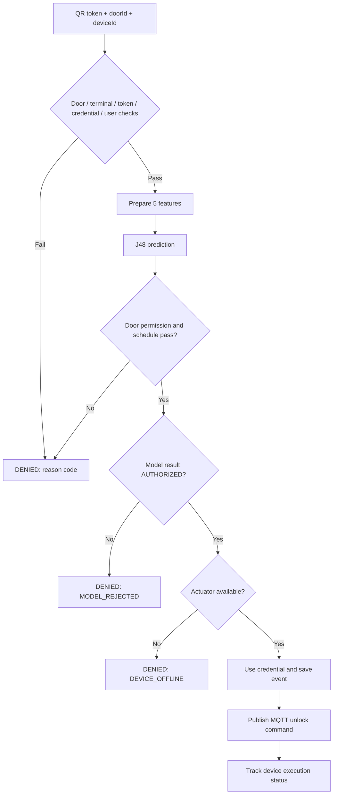

# SmartDoor Project တွင် Decision Tree အသုံးပြုပုံ — Study Report Guide

ဤ guide သည် SmartDoor project ၏ လက်ရှိ source code နှင့် training CSV ကို အခြေခံထားသည်။ Technical terms များကို English အတိုင်းထားပြီး system အလုပ်လုပ်ပုံ၊ model training၊ prediction နှင့် report တင်ပြနည်းတို့ကို မြန်မာဘာသာဖြင့် ရှင်းပြထားသည်။ ဖော်ပြထားသော dataset အရေအတွက်များသည် repository ရှိ CSV မှ ဖြစ်ပြီး runtime metric ရလဒ်များကို ခန့်မှန်းဖြည့်သွင်းထားခြင်း မရှိပါ။

## ၁။ Project အကျဉ်းချုပ်

SmartDoor သည် QR credential အသုံးပြု၍ တံခါးဝင်ခွင့်ကို စစ်ဆေးသော access-control system ဖြစ်သည်။ React frontend မှ webcam ဖြင့် QR ကို decode လုပ်ပြီး token ကို Spring Boot backend သို့ ပို့သည်။ Backend က credential၊ user၊ permission နှင့် schedule ကို စစ်ဆေးကာ Decision Tree ဖြင့်လည်း access request ကို classify လုပ်သည်။ လိုအပ်သည့် စစ်ဆေးမှုများအောင်မြင်ပါက MQTT မှတစ်ဆင့် ESP32 သို့မဟုတ် simulator ကို unlock command ပို့သည်။

ဤ project တွင် Decision Tree ၏တာဝန်သည် request တစ်ခုအတွက် `AUTHORIZED` သို့မဟုတ် `UNAUTHORIZED` ကို ခန့်မှန်းပေးခြင်းဖြစ်သည်။ QR image ကို decode လုပ်ခြင်း၊ token signature ကို စစ်ခြင်းနှင့် relay ကို တိုက်ရိုက်ထိန်းခြင်းတို့သည် model ၏တာဝန် မဟုတ်ပါ။

## ၂။ လေ့လာမှု၏ ရည်ရွယ်ချက်

ဤ project ကို လေ့လာပြီးနောက် အောက်ပါမေးခွန်းများကို ဖြေနိုင်သင့်သည်။

1. Decision Tree ကို system ၏ မည်သည့်နေရာတွင် အသုံးပြုသနည်း။
2. Model သို့ မည်သည့် features များ ပေးပို့သနည်း။
3. Training နှင့် prediction တို့ မည်သို့ကွာခြားသနည်း။
4. Model result နှင့် final access decision တို့ မည်သို့ဆက်စပ်သနည်း။
5. Accuracy၊ Precision၊ Recall နှင့် Confusion matrix တို့ကို မည်သို့အဓိပ္ပာယ်ဖော်သနည်း။
6. လက်ရှိ implementation တွင် မည်သည့် limitations ရှိသနည်း။

## ၃။ Decision Tree အခြေခံသဘောတရား

Decision Tree သည် labeled examples များမှ pattern များကို သင်ယူသော supervised classification model ဖြစ်သည်။ Input features များကို အခြေအနေအလိုက် ခွဲခြားပြီး နောက်ဆုံး class တစ်ခု ထုတ်ပေးသည်။

| Term | ရှင်းလင်းချက် |
|---|---|
| Feature | Prediction အတွက် ပေးသွင်းသော အချက်အလက်၊ ဥပမာ `doorAllowed` |
| Class / Label | Training example ၏ အဖြေ၊ ဥပမာ `AUTHORIZED` |
| Root node | Tree တွင် ပထမဆုံး စစ်ဆေးသော feature |
| Internal node | နောက်ထပ် condition စစ်ဆေးသော node |
| Branch | Condition ၏ value အလိုက် ဆက်သွားသော လမ်းကြောင်း |
| Leaf node | နောက်ဆုံး prediction class ကို ထုတ်ပေးသော node |
| Training | Labeled dataset မှ tree တည်ဆောက်ခြင်း |
| Inference / Prediction | တည်ဆောက်ထားသော tree ဖြင့် request အသစ်ကို classify လုပ်ခြင်း |
| Pruning | Training examples များအပေါ် အလွန်အကျွံမူတည်နိုင်သော tree ကို ရိုးရှင်းအောင် လျှော့ချခြင်း |

ဥပမာအားဖြင့် “door permission ရှိသလား”၊ “schedule အတွင်းလား” စသည့် မေးခွန်းများကို အဆင့်ဆင့်မေးပြီး အဖြေထုတ်သည့်ပုံစံဖြင့် နားလည်နိုင်သည်။ သို့သော် မည်သည့် feature ကို root node လုပ်မည်၊ branch များကို မည်သို့စီမည်ဆိုသည်ကို trained model က ဆုံးဖြတ်သည်။ ဤဥပမာကို project ၏ generated tree အတိအကျအဖြစ် မယူရပါ။

## ၄။ Project တွင် အသုံးပြုထားသော Model

`DecisionTreeService.java` တွင် WEKA ၏ `J48` classifier ကို အသုံးပြုထားသည်။ Model သည် Spring Boot backend process အတွင်း အလုပ်လုပ်သည်။ ESP32 အတွင်း model training သို့မဟုတ် prediction လုပ်ထားခြင်း မရှိပါ။

```java
classifier = new J48();
classifier.setConfidenceFactor(0.25f);
classifier.setMinNumObj(2);
classifier.buildClassifier(data);
```

`confidenceFactor = 0.25` သည် pruning နှင့်သက်ဆိုင်သော setting ဖြစ်သည်။ “Prediction တစ်ခုကို 25% ယုံကြည်သည်” ဟု မဆိုလိုပါ။ `minNumObj = 2` သည် leaf တစ်ခုအတွက် minimum instance count ကို သတ်မှတ်ပေးသော setting ဖြစ်သည်။

Tree ကို text အဖြစ် ကြည့်ရှုနိုင်သောကြောင့် feature values နှင့် classification တို့၏ ဆက်စပ်ပုံကို လေ့လာရန် အဆင်ပြေသည်။ သို့သော် လက်ရှိ code တွင် အခြား algorithms များနှင့် benchmark နှိုင်းယှဉ်ထားခြင်း မရှိသဖြင့် “J48 သည် ဤ project အတွက် အကောင်းဆုံး algorithm ဖြစ်ကြောင်း သက်သေပြပြီးဖြစ်သည်” ဟု report တွင် မရေးသင့်ပါ။

## ၅။ Training Dataset ကို နားလည်ခြင်း

Dataset သည် `backend/src/main/resources/ml/access-training.csv` တွင် ရှိသည်။ Header မပါဘဲ **၂၄ rows** ရှိပြီး **features ၅ ခု** နှင့် **class column ၁ ခု** ပါဝင်သည်။ Frontend က ဤ rows များကို synthetic data အဖြစ် ဖော်ပြထားသည်။ လက်တွေ့အသုံးပြုသူများထံမှ စုဆောင်းထားသော field dataset ဖြစ်ကြောင်း အထောက်အထား မရှိပါ။

| Column | Values | အဓိပ္ပာယ် |
|---|---|---|
| `doorAllowed` | `yes`, `no` | User တွင် သက်ဆိုင်ရာ door အတွက် permission ရှိ/မရှိ |
| `scheduleAllowed` | `yes`, `no` | လက်ရှိအချိန်သည် user ၏ allowed schedule အတွင်း ရှိ/မရှိ |
| `deviceRegistered` | `yes`, `no` | Request ပို့သော terminal registration စစ်ဆေးမှု အောင်မြင်/မအောင်မြင် |
| `userRole` | `ADMIN`, `STAFF`, `VISITOR` | User account ၏ role |
| `recentFailures` | `LOW`, `MEDIUM`, `HIGH` | လွန်ခဲ့သည့် ၁၅ မိနစ်အတွင်း user နှင့်ဆက်စပ်သော failed access events အရ bucket ခွဲထားခြင်း |
| `class` | `AUTHORIZED`, `UNAUTHORIZED` | Model သင်ယူရမည့် label |

လက်ရှိ dataset တွင် `AUTHORIZED` ၈ rows နှင့် `UNAUTHORIZED` ၁၆ rows ပါဝင်သည်။ `yes,yes,yes`၊ `LOW` ဖြစ်သော `ADMIN`၊ `STAFF`၊ `VISITOR` examples များကို တစ်ကြိမ်စီ ထပ်ထည့်ထားသဖြင့် unique rows ၂၁ ခုသာ ရှိသည်။

ဥပမာ row တစ်ခုကို ဖတ်ကြည့်ပါ။

```csv
yes,yes,yes,STAFF,LOW,AUTHORIZED
```

ဤ row သည် door permission ရှိ၊ schedule မှန်၊ terminal registered ဖြစ်၊ role က `STAFF` ဖြစ်ပြီး recent failures က `LOW` ဖြစ်သော example ကို `AUTHORIZED` label သတ်မှတ်ထားသည်ဟု ဆိုလိုသည်။

အခြား example တစ်ခုမှာ—

```csv
yes,yes,yes,VISITOR,MEDIUM,UNAUTHORIZED
```

ဤသည်မှာ dataset ထဲရှိ label ဖြစ်သည်။ Pruning နှင့် dataset အရွယ်အစားကြောင့် trained model က training row တိုင်းကို label အတိုင်း ပြန်ခန့်မှန်းမည်ဟု အာမခံမရပါ။ Report ရေးရာတွင် **dataset label** နှင့် **observed prediction** ကို သီးခြားမှတ်တမ်းတင်ရမည်။

## ၆။ Runtime Features များကို မည်သို့ပြင်ဆင်သနည်း

Features များကို `AccessService.verify()` က database နှင့် request context မှ ပြင်ဆင်ပေးသည်။

**`doorAllowed`** ကို user ID နှင့် door ID အတွက် permission record ရှိ/မရှိ query လုပ်၍ ရယူသည်။

**`scheduleAllowed`** ကို configured time zone ဖြင့် လက်ရှိ weekday နှင့် time ကို တွက်ပြီး user schedule နှင့် နှိုင်းယှဉ်သည်။ Start time ကို ထည့်တွက်ပြီး end time ကို မထည့်တွက်ပါ။ ဥပမာ schedule သည် `09:00–17:00` ဖြစ်လျှင် `09:00` ကို လက်ခံပြီး `17:00` ကို လက်မခံပါ။ Default application time zone သည် `Asia/Yangon` ဖြစ်ပြီး environment configuration ဖြင့် ပြောင်းနိုင်သည်။

**`deviceRegistered`** ကို prediction ခေါ်ချိန်တွင် `true` ဟု ပေးထားသည်။ အကြောင်းမှာ terminal မရှိခြင်း၊ type မမှန်ခြင်း သို့မဟုတ် door မကိုက်ခြင်းကို model မခေါ်မီ `DEVICE_UNREGISTERED` ဖြင့် reject လုပ်ပြီးသား ဖြစ်သောကြောင့် ဖြစ်သည်။ Dataset ထဲတွင် `no` examples ပါသော်လည်း လက်ရှိ access flow မှ model သို့ `no` မရောက်ပါ။

**`userRole`** ကို database user account မှ `user.getRole().name()` ဖြင့် ရယူသည်။

**`recentFailures`** ကို အောက်ပါအတိုင်း bucket ခွဲသည်။

| လွန်ခဲ့သည့် ၁၅ မိနစ်အတွင်း count | Bucket |
|---|---|
| ၀ သို့မဟုတ် ၁ | `LOW` |
| ၂ သို့မဟုတ် ၃ | `MEDIUM` |
| ၄ နှင့်အထက် | `HIGH` |

Repository query သည် အဆိုပါ user နှင့်ဆက်စပ်ပြီး `resultCode != 'GRANTED'` ဖြစ်သော events များကို ရေတွက်သည်။ Door တစ်ခုတည်းအတွက်သာ filter မလုပ်ထားပါ။ User မသိရသေးမီ reject ဖြစ်၍ user မချိတ်ထားသော events များကို ထို user ၏ count ထဲ မထည့်နိုင်ပါ။ ယခု request ၏ event ကို prediction နောက်မှ save လုပ်သောကြောင့် bucket တွက်ချိန်တွင် ယခု request မပါသေးပါ။

ထို့ကြောင့် `recentFailures` ကို “QR မှားဖတ်သည့် အကြိမ်ရေ” ဟုသာ အဓိပ္ပာယ်မဖော်သင့်ပါ။ User နှင့်ချိတ်ထားသော door permission failure၊ schedule failure စသည့် events များလည်း ပါနိုင်သည်။

## ၇။ Training Process — အဆင့်လိုက်

`train()` တွင် `@PostConstruct` ပါသောကြောင့် Spring service စတင်တည်ဆောက်ချိန်တွင် training လုပ်သည်။ QR scan တစ်ကြိမ်တိုင်း model အသစ် train လုပ်ခြင်း မရှိပါ။

1. Classpath ထဲမှ `ml/access-training.csv` ကို bytes အဖြစ် ဖတ်သည်။
2. WEKA `CSVLoader` ဖြင့် `Instances` dataset သို့ ပြောင်းသည်။
3. `setNominalAttributes("first-last")` ဖြင့် columns အားလုံးကို nominal attributes အဖြစ် သတ်မှတ်သည်။ `LOW`၊ `MEDIUM`၊ `HIGH` တို့သည် ဤ model တွင် numeric score မဟုတ်ဘဲ category names များ ဖြစ်သည်။
4. နောက်ဆုံး column ကို class label အဖြစ် သတ်မှတ်သည်။
5. J48 settings သတ်မှတ်ပြီး full dataset ဖြင့် classifier တည်ဆောက်သည်။
6. `new Instances(data, 0)` ဖြင့် prediction အတွက် schema ကို သိမ်းထားသည်။ Training rows မပါသော်လည်း attribute names နှင့် category definitions ပါဝင်သည်။
7. Cross-validation ဖြင့် evaluation metrics တွက်သည်။
8. Dataset bytes ၏ SHA-256 မှ ပထမ ၁၂ hex characters ကိုယူ၍ `j48-...` version string တည်ဆောက်သည်။
9. Version၊ metrics၊ tree text နှင့် training row count ကို model info အဖြစ် သိမ်းထားသည်။

လက်ရှိ flow သည် static CSV ကို startup တွင် train လုပ်သောပုံစံ ဖြစ်သည်။ Access logs မှ အလိုအလျောက် online learning လုပ်ခြင်း မရှိပါ။ Dataset ပြင်လျှင် runtime က အသုံးပြုသော resource ကို update လုပ်ပြီး backend ပြန်စတင်ရန် လိုသည်။ Packaged application သို့မဟုတ် container သုံးပါက updated CSV ပါဝင်အောင် rebuild လုပ်ရန်လည်း လိုနိုင်သည်။

## ၈။ Prediction Process — အဆင့်လိုက်

Prediction ခေါ်သည့်ပုံစံမှာ—

```java
decisionTree.predict(
    doorAllowed,
    scheduleAllowed,
    deviceRegistered,
    user.getRole().name(),
    failureBucket
);
```

`predict()` သည် `DenseInstance` အသစ်တည်ဆောက်ပြီး training schema နှင့် ချိတ်သည်။ Feature values ၅ ခုကို column order အတိုင်း ထည့်သည်။ Boolean values များကို `yes` သို့မဟုတ် `no` ပြောင်းပေးသည်။

Class column ကို `instance.setMissing(5)` ဖြင့် missing ထားသည်။ Request အသစ်၏ အဖြေကို မသိရသေးဘဲ model က ခန့်မှန်းပေးရမည်ဖြစ်သောကြောင့် ဖြစ်သည်။ `classifier.classifyInstance(instance)` မှရသော class index ကို `AUTHORIZED` သို့မဟုတ် `UNAUTHORIZED` အဖြစ် ပြန်ပြောင်းသည်။

Return value ဖြစ်သော `Prediction` တွင် `result`၊ `path` နှင့် `version` ပါဝင်သည်။ လက်ရှိ code က per-request probability သို့မဟုတ် confidence score မထုတ်ပေးပါ။

## ၉။ Model Result နှင့် Final Access Decision

အောက်ပါ diagram သည် backend ၏ **access flow** ဖြစ်ပြီး J48 ၏ generated tree မဟုတ်ပါ။



Model မခေါ်မီ door နှင့် terminal ကို စစ်သည်။ ထို့နောက် token signature၊ credential record နှင့် nonce၊ revocation၊ expiry၊ usage limit၊ user active status တို့ကို စစ်သည်။ တစ်ခုခုမအောင်မြင်လျှင် ချက်ချင်း reject လုပ်သည်။

ဤ checks များအောင်မြင်ပြီးနောက် model ကို ခေါ်သည်။ Model ခေါ်ပြီးသော်လည်း `doorAllowed` သို့မဟုတ် `scheduleAllowed` သည် false ဖြစ်ပါက `DOOR_NOT_PERMITTED` သို့မဟုတ် `OUTSIDE_ALLOWED_TIME` ဖြင့် reject လုပ်သည်။ ထို့ကြောင့် model prediction မှားပြီး `AUTHORIZED` ထွက်သော်လည်း ဤ mandatory controls များကို ကျော်လွှား၍ မရပါ။

Permission နှင့် schedule အောင်မြင်သော်လည်း model က `UNAUTHORIZED` ထုတ်လျှင် `MODEL_REJECTED` ဖြစ်သည်။ Model က access ကို ထပ်မံငြင်းပယ်နိုင်သော်လည်း မအောင်မြင်သော mandatory control ကို ခွင့်ပြုအဖြစ် ပြောင်းမပေးနိုင်ပါ။

နောက်ဆုံး actuator သို့မဟုတ် simulator တွင် နောက်ဆုံး ၂၀ စက္ကန့်အတွင်း heartbeat ရှိပြီး status သည် `OFFLINE`၊ `ERROR` မဖြစ်ကြောင်း စစ်သည်။ အောင်မြင်လျှင် ၅,၀၀၀ milliseconds unlock command ပို့သည်။ `GRANTED_COMMAND_SENT` သည် command ပို့သည့်အခြေအနေဖြစ်ပြီး physical door ပွင့်ပြီးကြောင်း အတည်ပြုချက် မဟုတ်ပါ။ Device မှ `UNLOCKED` message ရသောအခါ execution status ကို update လုပ်သည်။

MQTT publish မအောင်မြင်သည့် branch တွင် response သည် `DENIED / DEVICE_OFFLINE` ဖြစ်ပြီး event execution status ကို `DEVICE_TIMEOUT` ပြောင်းသည်။ လက်ရှိ code တွင် event ၏ `resultCode` က `GRANTED` အဖြစ် ကျန်နေသည်။ Logs နှင့် recent failure count ကို လေ့လာရာတွင် result code နှင့် execution status ကို သီးခြားဖတ်ရန် လိုသည်။

## ၁၀။ Evaluation Metrics ကို ရှင်းလင်းစွာဖတ်ခြင်း

Code တွင် `Math.min(5, data.numInstances())` ကို fold count အဖြစ် သုံးထားသည်။ လက်ရှိ ၂၄ rows အတွက် **5-fold cross-validation** ဖြစ်ပြီး random seed သည် `42` ဖြစ်သည်။ Dataset ကို ၅ ပိုင်းခွဲကာ အပိုင်းတစ်ပိုင်းကို evaluation အတွက်ချန်ပြီး ကျန်အပိုင်းများဖြင့် training လုပ်သောလုပ်ငန်းစဉ်ကို အလှည့်ကျ လုပ်သည်။ Report ထဲက metrics များသည် ထို cross-validation ရလဒ်များ ဖြစ်သည်။ Runtime prediction အတွက် classifier ကို full dataset ဖြင့် တည်ဆောက်ထားသည်။

ဤ project တွင် Precision နှင့် Recall တွက်ရာ၌ `AUTHORIZED` ကို target class အဖြစ် ရွေးထားသည်။

| Term | ဤ report တွင် အဓိပ္ပာယ် |
|---|---|
| TP | Actual `AUTHORIZED` ကို `AUTHORIZED` ဟု ခန့်မှန်းခြင်း |
| TN | Actual `UNAUTHORIZED` ကို `UNAUTHORIZED` ဟု ခန့်မှန်းခြင်း |
| FP | Actual `UNAUTHORIZED` ကို `AUTHORIZED` ဟု ခန့်မှန်းခြင်း |
| FN | Actual `AUTHORIZED` ကို `UNAUTHORIZED` ဟု ခန့်မှန်းခြင်း |

```text
Accuracy  = (TP + TN) / (TP + TN + FP + FN)
Precision = TP / (TP + FP)
Recall    = TP / (TP + FN)
```

**Accuracy** သည် စုစုပေါင်း examples များထဲမှ မှန်ကန်စွာ classify လုပ်နိုင်သည့် အချိုးဖြစ်သည်။

**Precision** သည် `AUTHORIZED` ဟု ခန့်မှန်းထားသော examples များထဲမှ အမှန်တကယ် `AUTHORIZED` ဖြစ်သည့်အချိုးဖြစ်သည်။ Access control အတွက် FP ကို စောင့်ကြည့်ရန် အသုံးဝင်သည်။ သို့သော် model FP တစ်ခုတိုင်းသည် physical door မှားဖွင့်ခြင်းနှင့် တိုက်ရိုက်မတူပါ။ Mandatory checks များက ထပ်မံတားဆီးနိုင်သည်။

**Recall** သည် actual `AUTHORIZED` examples များထဲမှ model က `AUTHORIZED` ဟု မှန်ကန်စွာ ရှာတွေ့နိုင်သည့်အချိုးဖြစ်သည်။ Recall နည်းပါက ဝင်ခွင့်ရှိသူများကို model က ပယ်ချနိုင်ခြေ ပိုများသည်။

**Confusion matrix** ကို ဖတ်ရာတွင် WEKA output ၏ class legend နှင့် `classified as` column labels ကို အရင်ကြည့်ပါ။ Rows သည် actual class၊ columns သည် predicted class ဖြစ်သည်။ `a` နှင့် `b` ကို class names နှင့် မတွဲကြည့်ဘဲ ကိုယ့်သဘောဖြင့် သတ်မှတ်မဖတ်ရပါ။

လက်ရှိ dataset သည် သေးငယ်ပြီး repeated rows ပါသောကြောင့် duplicate examples များ training fold နှင့် evaluation fold နှစ်ခုစလုံးတွင် ရောက်နိုင်သည်။ ထို့ကြောင့် metrics ကောင်းသည်ဆိုရုံဖြင့် real-world performance သို့မဟုတ် security ကို အတည်ပြု၍ မရပါ။

## ၁၁။ Model Page နှင့် Access Logs ကို လေ့လာခြင်း

Frontend ၏ `/model` page သည် `GET /api/model/info` ကို ခေါ်ပြီး အောက်ပါတို့ကို ပြသည်။

- Model version နှင့် training row count
- Accuracy၊ Precision၊ Recall ကို percentage ဖြင့်ပြထားသော cards
- `classifier.toString()` မှ generated tree
- Cross-validation confusion matrix

Generated tree ကို ဖတ်ရာတွင် အပေါ်ဆုံး condition မှ စဖတ်ပြီး input နှင့်ကိုက်သော branch အတိုင်း အောက်သို့ ဆင်းပါ။ Leaf တွင် ပြထားသော class သည် prediction ဖြစ်သည်။ Leaf နောက်မှ parentheses ထဲက counts များကို per-request confidence percentage ဟု မယူရပါ။

Access event တွင် `modelResult`၊ `modelVersion` နှင့် `evaluationPath` ကို သိမ်းသည်။ Model မခေါ်မီ reject ဖြစ်ပါက model fields များသည် null ဖြစ်နိုင်သည်။

အောက်ပါသည် low-risk STAFF request တစ်ခုအတွက် model logging format ၏ ဥပမာဖြစ်သည်။

```text
MODEL doorAllowed=yes
MODEL scheduleAllowed=yes
MODEL deviceRegistered=yes
MODEL userRole=STAFF
MODEL recentFailures=LOW
MODEL result=AUTHORIZED
```

`evaluationPath` တွင် mandatory check markers၊ model input values နှင့် result တို့ကို ပေါင်းထည့်ထားသည်။ **J48 အတွင်း အမှန်တကယ် ဖြတ်သန်းခဲ့သော node-by-node traversal ကို ထုတ်ထားခြင်း မဟုတ်ပါ။** “Explainability အပြည့်အစုံရှိသည်” ဟု မရေးဘဲ “input နှင့် result ကို audit လုပ်နိုင်ပြီး generated tree ကို သီးခြားကြည့်နိုင်သည်” ဟု ရေးခြင်းက ပိုတိကျသည်။

## ၁၂။ လက်တွေ့ Study လုပ်ရန် အစီအစဉ်

ပထမဦးစွာ CSV မှ example တစ်ခုကို ရွေး၍ feature တစ်ခုချင်းစီ၏ အဓိပ္ပာယ်ကို ရေးပါ။ ထို့နောက် `DecisionTreeService.train()` နှင့် `predict()` ကိုဖတ်ပြီး training data မှ runtime input သို့ ပြောင်းလဲပုံကို လိုက်ကြည့်ပါ။ နောက်ဆုံး `AccessService.verify()` ကိုဖတ်၍ model result နောက်တွင် မည်သည့် checks များ ဆက်လုပ်သည်ကို မှတ်သားပါ။

လက်ရှိ model unit tests တွင် အောက်ပါ cases နှစ်ခု ပါသည်။

| Test | Input အကျဉ်း | Test က စစ်ထားသော result |
|---|---|---|
| `authorizesLowRiskPermittedStaff` | `true, true, true, STAFF, LOW` | `AUTHORIZED` နှင့် training rows > 10 |
| `rejectsWrongDoor` | `false, true, true, STAFF, LOW` | `UNAUTHORIZED` |

ဤ guide ပြုစုချိန်တွင် tests ကို အသစ်ပြန်မ run ထားပါ။ Test source တွင် မည်သည့် expectations ရှိသည်ကိုသာ ဖော်ပြထားသည်။ စမ်းသပ်လိုပါက backend directory မှ `./mvnw -Dtest=DecisionTreeServiceTest test` ကို run နိုင်သည်။

System ကို run ထားသောအခါ အောက်ပါ study cases များအတွက် actual result ကို မှတ်တမ်းတင်ပါ။

| Case | စမ်းသပ်ရမည့်အခြေအနေ | လေ့လာရမည့်အချက် |
|---|---|---|
| A | Valid STAFF၊ permission/schedule pass၊ `LOW`၊ actuator online | Model result၊ final decision နှင့် device execution တို့ကို ခွဲကြည့်ရန် |
| B | Valid credential ဖြစ်သော်လည်း door permission မရှိ | Final reason သည် `DOOR_NOT_PERMITTED` ဖြစ်ပုံ |
| C | Allowed schedule ပြင်ပ | Final reason သည် `OUTSIDE_ALLOWED_TIME` ဖြစ်ပုံ |
| D | Terminal မမှတ်ပုံတင်ထား | Model မခေါ်မီ `DEVICE_UNREGISTERED` ဖြစ်ပုံ |
| E | `VISITOR` နှင့် `MEDIUM` | Dataset label နှင့် observed prediction ကို နှိုင်းယှဉ်ရန် |
| F | Model `AUTHORIZED` ဖြစ်သော်လည်း actuator offline | `AUTHORIZED` နှင့် `GRANTED` မတူကြောင်း |
| G | Credential expired | Model မခေါ်မီ `CREDENTIAL_EXPIRED` ဖြစ်ပုံ |

Case တစ်ခုချင်းစီတွင် input features၊ dataset label ရှိလျှင် ထို label၊ actual model result၊ final reason code၊ execution status နှင့် model version ကို မှတ်တမ်းတင်ပါ။ ထပ်ခါတလဲလဲ denial cases စမ်းသပ်ပါက recent failure count တိုးလာပြီး နောက် case ၏ input bucket ပြောင်းသွားနိုင်သည်။ သီးခြား test user သို့မဟုတ် ထိန်းချုပ်ထားသော fixture သုံး၍ အခြေအနေကို ရှင်းလင်းစွာ မှတ်တမ်းတင်သင့်သည်။

## ၁၃။ လက်ရှိ Implementation ၏ Limitations

**Dataset အရွယ်အစားနှင့် coverage။** Training rows ၂၄ ခုသာရှိပြီး feature combinations အားလုံး မပါဝင်ပါ။ သတ်မှတ်ထားသော values များအရ combinations ၂ × ၂ × ၂ × ၃ × ၃ = ၇၂ မျိုး ဖြစ်နိုင်သော်လည်း unique training rows ၂၁ ခုသာ ရှိသည်။

**Synthetic labels နှင့် real-world evidence။** Model သည် CSV ထဲတွင် သတ်မှတ်ထားသော labels များကို သင်ယူသည်။ လက်တွေ့ intrusion detection performance ကို အဆိုပါ dataset ဖြင့်သာ သက်သေမပြနိုင်ပါ။

**Training နှင့် runtime input ကွာခြားမှု။** `deviceRegistered=no` ကို training ထဲတွင် တွေ့ရသော်လည်း runtime prediction သို့ မရောက်ပါ။ ဤ feature ၏ production contribution ကို သုံးသပ်ရာတွင် ထိုအချက်ကို ထည့်စဉ်းစားရမည်။

**Audit detail အကန့်အသတ်။** Logged path သည် inputs နှင့် output ကိုပြပြီး actual node traversal သို့မဟုတ် probability ကို မပြပါ။

**Version အကန့်အသတ်။** လက်ရှိ version သည် CSV bytes ကိုသာ hash လုပ်ထားသည်။ Dataset တူပြီး classifier settings၊ code သို့မဟုတ် dependency version ပြောင်းလျှင် model version string မပြောင်းနိုင်ပါ။ Dataset formatting သာပြောင်းလျှင်လည်း bytes ပြောင်းသဖြင့် version ပြောင်းနိုင်သည်။

**Failure count ၏ အဓိပ္ပာယ်။** `recentFailures` သည် non-GRANTED event count ဖြစ်ပြီး malicious behavior ကို တိုက်ရိုက်တိုင်းတာခြင်း မဟုတ်ပါ။ `MODEL_REJECTED` events များလည်း နောက် request များ၏ count ထဲ ပြန်ဝင်နိုင်သဖြင့် user ၏ နောက်ထပ် classification ကို သက်ရောက်စေနိုင်သည်။

အနာဂတ်လေ့လာမှုအဖြစ် ပိုမိုစုံလင်သော labeled dataset၊ duplicate-aware evaluation၊ သီးခြား holdout set၊ role အလိုက် FP/FN analysis၊ pure rule-based baseline နှင့် နှိုင်းယှဉ်မှုတို့ကို လုပ်နိုင်သည်။ ဤအချက်များသည် အကြံပြုထားသော နောက်ဆက်တွဲလုပ်ငန်းများဖြစ်ပြီး လက်ရှိ project တွင် ပြီးစီးထားသော features မဟုတ်ပါ။

## ၁၄။ Study Report ရေးရန် အသင့်သုံးဖွဲ့စည်းပုံ

| Report section | ထည့်ရေးရမည့်အကြောင်းအရာ |
|---|---|
| Introduction | QR-based SmartDoor ၏ ရည်ရွယ်ချက်နှင့် access classification ပြဿနာ |
| Objectives | Features၊ training၊ prediction နှင့် mandatory checks တို့ကို လေ့လာလိုသည့်ရည်ရွယ်ချက် |
| System Design | React → Spring Boot → MariaDB/MQTT → ESP32 flow နှင့် model တည်နေရာ |
| Dataset | Synthetic rows ၂၄ ခု၊ features ၅ ခု၊ class distribution နှင့် duplicates |
| Methodology | WEKA J48 settings၊ startup training၊ nominal attributes၊ 5-fold cross-validation |
| Implementation | Feature extraction၊ prediction၊ final decision နှင့် event logging |
| Results | တကယ် run ထားသော model version၊ metrics၊ generated tree နှင့် test observations |
| Discussion | Model result နှင့် final access decision ကွာခြားချက်၊ FP/FN နှင့် limitations |
| Conclusion | လေ့လာတွေ့ရှိချက်နှင့် နောက်ဆက်တွဲတိုးတက်စေရန် အချက်များ |

Report တွင် သုံးနိုင်သော အကျဉ်းချုပ်စာပိုဒ်—

> SmartDoor project တွင် WEKA J48 Decision Tree ကို Spring Boot backend အတွင်း access request classification အတွက် အသုံးပြုထားသည်။ Model သည် door permission၊ schedule၊ terminal registration၊ user role နှင့် recent failure bucket ဟူသော features ငါးခုကို အသုံးပြု၍ AUTHORIZED သို့မဟုတ် UNAUTHORIZED result ထုတ်ပေးသည်။ Training ကို synthetic CSV dataset ဖြင့် application startup တွင် လုပ်ဆောင်ပြီး 5-fold cross-validation ဖြင့် evaluation လုပ်သည်။ Final access decision တွင် credential validity နှင့် mandatory policy checks များကို ဆက်လက်လိုအပ်သဖြင့် model သည် access-control process ၏ အစိတ်အပိုင်းတစ်ခုအဖြစ် ပါဝင်သည်။ လက်ရှိ dataset သေးငယ်မှုနှင့် synthetic data ဖြစ်မှုကြောင့် real-world performance ကို ထပ်မံစမ်းသပ်ရန် လိုအပ်သည်။

## ၁၅။ Presentation / Viva အတွက် မေးခွန်းနှင့်အဖြေ

**Decision Tree က ဘာကို predict လုပ်သနည်း။** Access request ၏ features ကို အသုံးပြုပြီး `AUTHORIZED` သို့မဟုတ် `UNAUTHORIZED` ကို predict လုပ်သည်။

**QR code ကို Decision Tree က ဖတ်သနည်း။** မဖတ်ပါ။ Frontend က QR ကို decode လုပ်ပြီး backend က token ကို verify လုပ်သည်။ Model က ပြင်ဆင်ပြီးသား access features ကို လက်ခံသည်။

**Model က AUTHORIZED ဆိုလျှင် တံခါးအမြဲပွင့်သလား။** မပွင့်ပါ။ Permission၊ schedule၊ actuator availability နှင့် command execution တို့လည်း အောင်မြင်ရန် လိုသည်။

**Scan တစ်ကြိမ်တိုင်း train လုပ်သလား။** မလုပ်ပါ။ Startup တွင် train လုပ်ပြီး request တစ်ခုချင်းစီအတွက် prediction လုပ်သည်။

**ADMIN role ဖြစ်လျှင် checks အားလုံးကျော်နိုင်သလား။** မကျော်နိုင်ပါ။ လက်ရှိ `AccessService` တွင် ADMIN အတွက် permission သို့မဟုတ် schedule bypass မရှိပါ။

**Accuracy ကောင်းလျှင် system လုံခြုံပြီလား။** Accuracy သည် evaluation dataset အပေါ် classification မှန်ကန်မှုကို ဖော်ပြသည်။ End-to-end security သို့မဟုတ် physical unlock reliability တစ်ခုလုံးကို တိုင်းတာခြင်း မဟုတ်ပါ။

**Logs ထဲက evaluationPath က actual tree traversal လား။** မဟုတ်ပါ။ Mandatory checks၊ feature values နှင့် model result ကို စုထားသော audit information ဖြစ်သည်။

## ၁၆။ Source Code လေ့လာရန် လမ်းညွှန်

အောက်ပါ references များကို အစဉ်လိုက်ဖတ်လျှင် data မှ prediction၊ prediction မှ door command သို့ ဆက်စပ်ပုံကို နားလည်နိုင်သည်။

1. [Training dataset](../backend/src/main/resources/ml/access-training.csv) — features နှင့် class labels။
2. [DecisionTreeService](../backend/src/main/java/com/smartdoor/service/DecisionTreeService.java) — training၊ prediction၊ evaluation နှင့် version။
3. [AccessService](../backend/src/main/java/com/smartdoor/service/AccessService.java) — mandatory checks၊ feature extraction နှင့် final decision။
4. [AccessEventRepository](../backend/src/main/java/com/smartdoor/repository/AccessEventRepository.java) — recent failures ရေတွက်သော query။
5. [ModelController](../backend/src/main/java/com/smartdoor/api/ModelController.java) — model info API။
6. [ModelPage](../frontend/src/pages/ModelPage.tsx) — metrics၊ generated tree နှင့် confusion matrix UI။
7. [DecisionTreeServiceTest](../backend/src/test/java/com/smartdoor/service/DecisionTreeServiceTest.java) — model test cases။
8. [DeviceMessageService](../backend/src/main/java/com/smartdoor/service/DeviceMessageService.java) — device message မှ execution status ပြောင်းလဲပုံ။
9. [Architecture](architecture.md) — system boundaries နှင့် access precedence။
