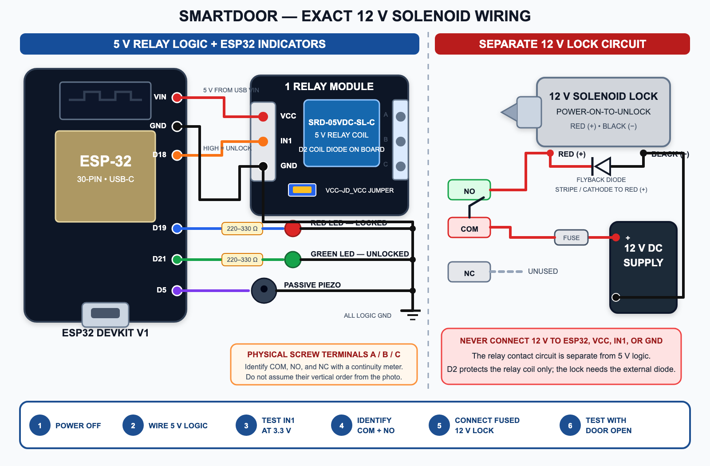
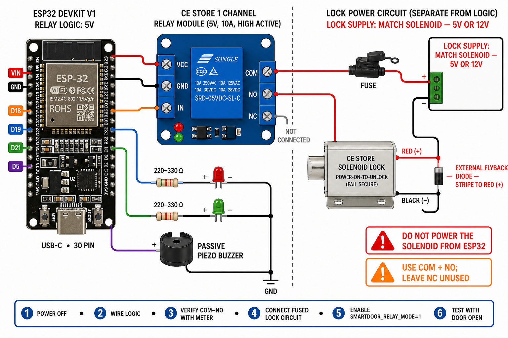
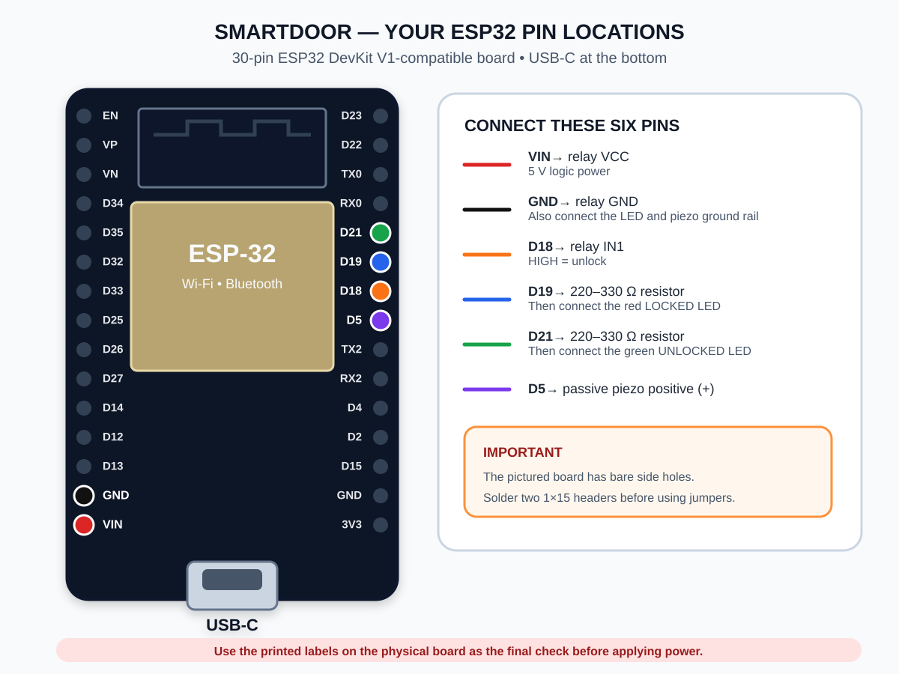

# Physical hardware and setup

SmartDoor uses a computer webcam as the QR scanner. The ESP32 is only the door actuator: it connects to Wi-Fi and MQTT, receives an authorized unlock command, activates a relay that powers the solenoid, operates the indicators, and relocks automatically.



All ground symbols on the logic side connect to ESP32 `GND`. The separate lock-supply negative connects only to the solenoid circuit; the relay contacts provide the switching isolation.

### Additional component-layout reference



> **Reference only:** this supplied image depicts a generic relay module and still shows a 5 V/12 V lock choice. For the actual build, use the verified diagram above: the lock supply is **12 V**, the pictured relay input is `IN1`, and the physical `COM`/`NO` screw terminals must be identified with a continuity meter.

On the pictured relay module, the diagram's `IN` terminal is printed as `IN1`. Leave the blue jumper installed across `VCC` and `JD_VCC` for the single-supply setup documented here.



## 1. Hardware requirements

### Required for the supported prototype

| Quantity | Part | Requirement or example |
| ---: | --- | --- |
| 1 | Computer | Runs Docker, the SmartDoor web application, Mosquitto, and the webcam scanner |
| 1 | Webcam | Built-in or USB camera capable of reading the displayed QR code |
| 1 | Wi-Fi network | 2.4 GHz network reachable by both the computer and ESP32; client isolation must be disabled |
| 1 | ESP32 development board | The pictured 30-pin ESP32 DevKit V1-compatible USB-C board |
| 1 | USB-C data cable | Must support data as well as power; charge-only cables cannot upload firmware |
| 2 | 1x15, 2.54 mm male pin headers | Solder to the pictured board if its side headers are not already installed |
| 1 | CE Store solenoid door lock | Confirmed 12 V, power-on-to-unlock model |
| 1 | Regulated 12 V DC lock supply | Current rating must cover the lock's inrush and continuous current with margin |
| 1 | Pictured 1-channel relay module | 5 V `SRD-05VDC-SL-C` relay board labeled `VCC`, `IN1`, `GND`, and `VCC/JD_VCC` |
| 1 | Regulated 5 V logic supply | Powers only the relay module if the ESP32 board's USB `5V`/`VIN` pin is not used |
| 1 | Flyback diode | Reverse-voltage and forward-current ratings must exceed the lock supply voltage and measured coil current |
| 1 | Inline fuse and holder | Size from the seller-confirmed/measured normal and inrush current and the wire rating |
| 1 each | Red and green LED | Standard low-current 3 mm or 5 mm LED |
| 2 | 220-330 ohm resistor | One current-limiting resistor for each LED |
| 1 | Passive piezo buzzer | A small, high-impedance piezo suitable for an MCU signal; do not attach a speaker or high-current siren directly |
| 1 each | Terminal block, enclosure, and hookup wire | Wire, connectors, and fuse must be rated for the measured lock current |
| 1 each | Breadboard and jumper-wire set | Use the breadboard only for ESP32 logic; use secure terminals for the solenoid-current path |

The ESP32 can be powered from its USB cable. The relay module needs 5 V and must share logic ground with the ESP32. The solenoid uses its separate regulated 12 V DC supply through the isolated relay contacts; never connect 12 V to an ESP32 or relay-logic pin.

### Software requirements

- Docker Desktop with Docker Compose
- VS Code with the PlatformIO IDE extension, or PlatformIO Core (`pio`)
- A modern browser with camera permission enabled for `http://localhost:5173`
- USB serial driver for the development board when the operating system does not install one automatically (commonly CP210x or CH340)

### Relay requirements and 3.3 V input check

The pictured module uses an `SRD-05VDC-SL-C` 5 V relay. Read the contact ratings printed on the actual relay case and verify that the solenoid's measured inrush and steady current are safely below its DC rating. An AC contact rating must not be treated as an equal DC rating.

The blue jumper in the photo bridges `VCC` and `JD_VCC`, allowing one 5 V logic supply to power both the module input circuit and relay coil. Keep it installed for this setup. Removing it requires a separately designed relay-coil supply and is not needed here.

The module is powered at 5 V, but an ESP32 outputs only 3.3 V on GPIO 18. Before connecting the lock, power the module at 5 V and verify that `IN1 = LOW` leaves the relay off and `IN1 = 3.3 V` makes it click. This confirms both 3.3 V compatibility and high-active behavior. If it does not switch reliably, add a non-inverting 3.3-to-5 V logic buffer such as a 74AHCT125 with a 10 kohm pull-down on its input. Never apply 5 V to an ESP32 GPIO.

Do not infer `NC`, `COM`, and `NO` from the screw terminal's vertical position when the printing is unclear. Identify them with a continuity meter while the lock supply is disconnected:

1. With the relay off, find the two connected terminals; they are `COM` and `NC`. The remaining terminal is `NO`.
2. Energize the relay input and find the new connected pair; they are `COM` and `NO`.
3. The terminal present in both connected pairs is `COM`. Label all three terminals before adding lock wiring.

## 2. Jumper and wiring instructions

Disconnect USB and the 12 V lock supply while assembling the circuit.

For the pictured board, hold it with the ESP32 antenna at the top and USB-C connector at the bottom. `VIN` and `GND` are the bottom two pins on the left header. The four firmware GPIO pins are consecutive on the middle of the right header in this order from top to bottom: `D21`, `D19`, `D18`, `D5`. Use the printed labels on the actual board as the final check before powering it.

| ESP32 connection | Connect to | Notes |
| --- | --- | --- |
| ESP32 GPIO 18 (`D18`) | Relay module `IN1` | High-active unlock signal; first verify that the module recognizes 3.3 V |
| ESP32 `5V`/`VIN` while USB-powered | Relay module `VCC` | Relay module requires 5 V; do not use ESP32 `3V3` |
| ESP32 `GND` | Relay module `GND` | Logic-side common ground is required |
| 12 V supply positive | Inline fuse, then relay `COM` | This is the separate lock-power circuit, not relay logic power |
| Relay `NO` | Solenoid red wire | `NO` closes to `COM` only during an unlock; leave `NC` unused |
| Solenoid black wire | Lock-supply negative | Observe the product's red-positive, black-negative polarity |
| Flyback diode cathode (striped end) | Solenoid red / relay-`NO` node | Reverse-biased during normal operation |
| Flyback diode anode (unstriped end) | Solenoid black / supply-negative node | Never reverse these diode connections |
| GPIO 19 (`D19`) | 220-330 ohm resistor, then red LED anode (long leg) | Red means locked |
| ESP32 `GND` | Red LED cathode (short leg/flat side) | The resistor may be placed on either side of the LED |
| GPIO 21 (`D21`) | 220-330 ohm resistor, then green LED anode (long leg) | Green means unlocked |
| ESP32 `GND` | Green LED cathode (short leg/flat side) | Do not omit the resistor on physical hardware |
| GPIO 5 (`D5`) | Passive piezo `+` | Firmware produces a 1600 Hz, 120 ms tone |
| ESP32 `GND` | Passive piezo `-` | Use a transistor driver for an active buzzer or any device exceeding the GPIO rating |

The resulting connections are:

```text
ESP32 5V/VIN ---------------------- relay VCC
ESP32 GND ------------------------- relay GND
ESP32 D18 ------------------------- relay IN1 (HIGH = unlock)

12 V supply + ---- fuse ---- relay COM
                              relay NO ----+---- red [ 12 V SOLENOID ] black ---- 12 V supply -
                                          |          flyback          |
                                          +-----------|<|-------------+
                                                      stripe toward red
                              relay NC ---- not connected

ESP32 D19 ---- 220-330 ohm ----|>|-- GND   red LED
ESP32 D21 ---- 220-330 ohm ----|>|-- GND   green LED
ESP32 D5 -----------------------( )-- GND   passive piezo
```

The flyback diode's striped cathode connects to the red/positive side and its unstriped anode connects to the black/negative side. It must not conduct while the solenoid is energized; it conducts only when the relay opens and clamps the inductive voltage spike. The diode already visible on the relay board protects the small relay coil, not the external door-lock solenoid.

At startup GPIO 18 stays low, the high-active relay remains off, `COM` remains disconnected from `NO`, and the solenoid stays de-energized. An accepted command drives GPIO 18/`IN1` high, closes `COM` to `NO`, energizes the solenoid, changes the indicator to green, sounds the piezo, and drives GPIO 18 low again after five seconds. The firmware also switches the relay off if Wi-Fi or MQTT connectivity is lost.

## 3. Host application setup

From the repository root:

```bash
cp .env.example .env
docker compose up --build -d
docker compose stop device-simulator
docker compose ps
```

Edit `.env` before exposing the system beyond a private development network. At minimum, replace `SMARTDOOR_ADMIN_PASSWORD`, `SMARTDOOR_QR_SECRET`, and `MQTT_PASSWORD`. Stopping `device-simulator` is important because the simulated and physical actuators subscribe to the same command topic and would otherwise unlock together.

Find the computer's private LAN address, such as `192.168.1.25`. The ESP32 must use this address for `MQTT_HOST`; `localhost` means the ESP32 itself, `mosquitto` only resolves inside Docker, and `host.wokwi.internal` is only for Wokwi.

Confirm that the computer firewall permits inbound TCP port `1883` from the trusted local network. Do not expose this development MQTT listener to the internet; it does not use TLS.

## 4. ESP32 firmware setup

Create the local secrets file:

```bash
cp firmware/include/secrets.example.h firmware/include/secrets.h
```

Edit `firmware/include/secrets.h` for the physical network:

```cpp
#pragma once
#define WIFI_SSID "YOUR_2_4_GHZ_WIFI_NAME"
#define WIFI_PASSWORD "YOUR_WIFI_PASSWORD"
#define MQTT_HOST "192.168.1.25"
#define MQTT_PORT 1883
#define MQTT_USERNAME "smartdoor"
#define MQTT_PASSWORD "THE_VALUE_FROM_DOT_ENV"
#define SMARTDOOR_RELAY_MODE 1
```

`secrets.h` is excluded from Git. The Wi-Fi network must provide internet access to `pool.ntp.org`, because the firmware rejects MQTT commands when its clock is not synchronized.

Connect the ESP32 by USB, then build and upload from the repository root:

```bash
cd firmware
pio run
pio run --target upload
pio device monitor
```

If PlatformIO cannot choose the correct serial port, list available ports with `pio device list`, then run the upload with `--upload-port`, for example:

```bash
pio run --target upload --upload-port /dev/cu.usbserial-0001
```

The serial monitor speed is 115200 baud. The current firmware waits silently while connecting, so a device that never appears online usually has an incorrect Wi-Fi network, broker address, MQTT credential, blocked port, or unavailable NTP connection. Press the ESP32 `EN`/reset button after correcting and reflashing it.

## 5. Bring-up and functional test

1. Double-check every connection with all power removed, especially the common ground and LED polarity.
2. Keep the `VCC/JD_VCC` jumper installed. With the solenoid and lock supply disconnected, power the relay module and test its 3.3 V `IN1` response. Identify the screw terminals with a continuity meter, then confirm `COM`-`NO` is open at boot, closes only while GPIO 18 is high, and opens again after five seconds.
3. Remove all power, connect the fused solenoid circuit, then power the ESP32 and the regulated 12 V lock supply.
4. Open `http://localhost:5173`, sign in, and open **Door Status**.
5. Wait up to 20 seconds for `ESP32-DOOR-01` to show `LOCKED` and online. A heartbeat is sent every five seconds.
6. Create a user, grant **Main Door** permission, and add a schedule that includes the current time.
7. Issue a QR credential. Open **Webcam Scanner** and scan it, or upload the QR PNG.
8. Confirm this sequence: red LED off, green LED on, short tone, bolt retracts, then power is removed from the lock and the bolt extends after five seconds.
9. Open **Access Logs** and confirm the request progresses from `GRANTED_COMMAND_SENT` to `UNLOCKED`.

Test the electronics and software on the bench before mounting the lock. Then test repeatedly with the door open so a wiring, alignment, or software fault cannot lock anyone in or out. Keep the default five-second unlock time unless the seller confirms a longer coil duty cycle is safe.

## 6. Troubleshooting

| Symptom | Checks |
| --- | --- |
| ESP32 never appears online | Use the computer's LAN IP for `MQTT_HOST`; check 2.4 GHz Wi-Fi, MQTT credentials, TCP 1883, Mosquitto health, and NTP access |
| `SIM-DOOR-01` responds instead | Run `docker compose stop device-simulator`; only one actuator should serve `DOOR-01` |
| ESP32 resets when the lock activates | Keep lock current off the ESP32 rails, verify the external flyback diode, shorten high-current wiring, and check supply voltage drop |
| Solenoid becomes hot | Remove power; verify that the supply is regulated 12 V, then confirm maximum energization time and duty cycle with the seller |
| LEDs do not light | Check polarity, series resistors, GPIO 19/21 placement, and the common ground |
| Relay does not click with GPIO high | Confirm the `VCC/JD_VCC` jumper is installed, relay `VCC` is 5 V, and grounds are common; measure GPIO 18/`IN1`; if 3.3 V is insufficient, add a non-inverting 3.3-to-5 V buffer |
| Access granted but no movement | Confirm relay mode is `1`, use a meter to check `COM`-`NO`, verify red/black polarity and lock-supply voltage under load, and inspect the access log for device errors |
| MQTT authentication fails | Make `.env` and `secrets.h` credentials identical, rebuild and reflash, then restart the ESP32 |

## 7. Safety limits

This is an academic prototype. Do not install it on an emergency exit, fire door, or any opening where failure could endanger or trap a person. Do not rely on it as the sole access or life-safety mechanism. Keep low-voltage logic isolated from mains and lock power, fuse real-lock circuits appropriately, and provide a mechanical/manual release that works during power, network, and controller failures.
